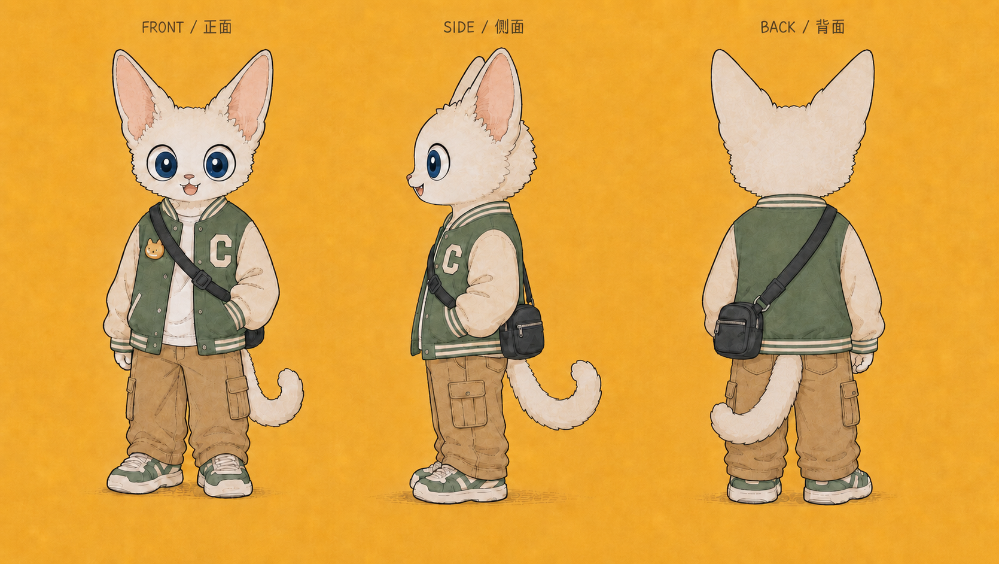
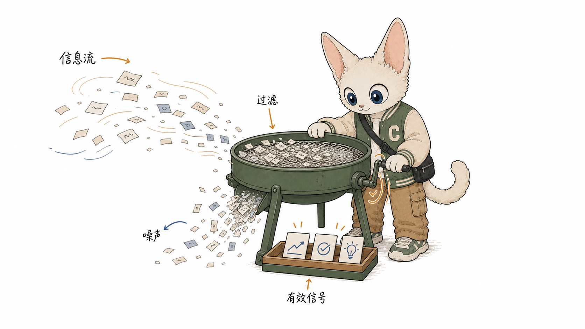
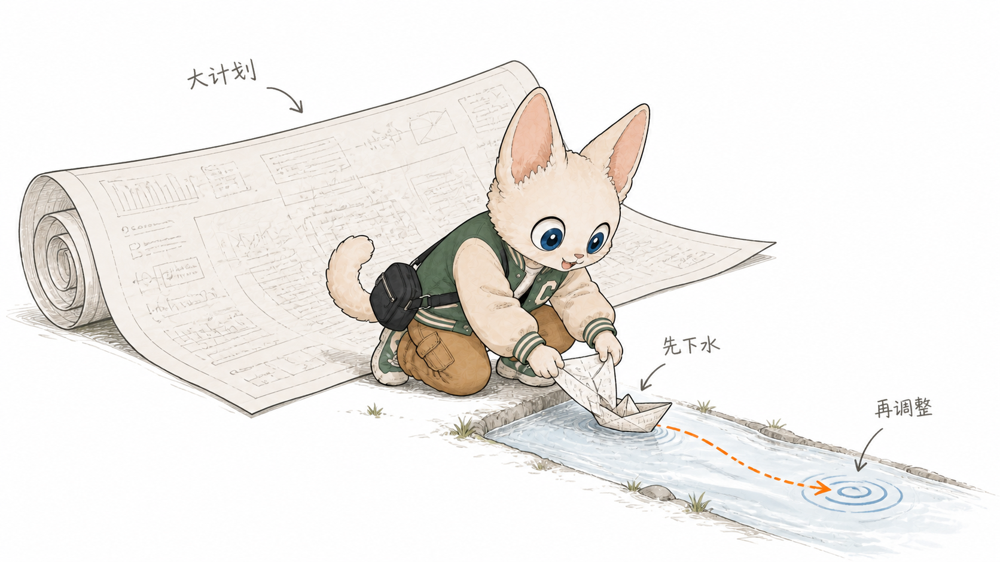
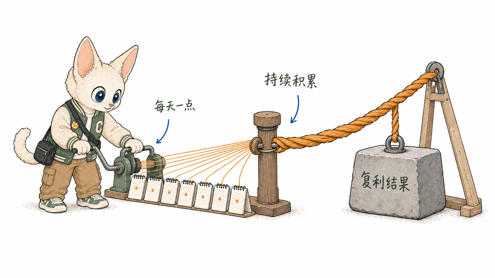
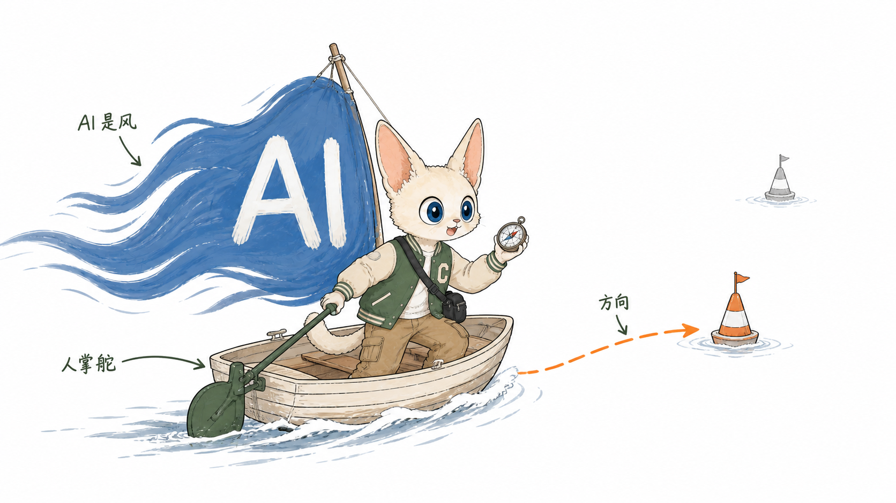

# Devon Cat Illustrations｜德文猫 IP 正文配图

> 把中文文章里的判断、流程、状态和隐喻，变成一张张由「德文猫」亲自推动的白底手绘正文配图。
>
> 16:9 横版 · 德文猫 IP · 彩色手绘 · 认知隐喻 · Codex Skill

[](SKILL.md)
[](LICENSE)
[](ASSET-LICENSE.md)

---

## 这个仓库是什么

**Devon Cat Illustrations（德文猫 IP 正文配图）** 是一个为中文内容设计的 Agent Skill。它会先理解文章里的认知锚点，再把其中一个判断、流程、结构、状态或隐喻，转换成一张有记忆点的 16:9 横版正文配图。

它不是“随便画一只猫”，也不是给旧插画简单换皮。德文猫会在画面里亲自筛选、搭建、测量、连接、记录或验证，让读者一眼看见文章中真正发生的认知动作。

一句话：**让德文猫把抽象知识做给读者看。**

---

## 德文猫是谁

德文猫是一只好奇、会动手、愿意探索和验证的内容伙伴：奶白色毛发、超大尖耳、深蓝大眼、森林绿棒球夹克、卡其工装裤、绿白运动鞋、黑色斜挎包和卷曲长尾。

这里的「德文猫」不是泛指普通猫咪图片，而是以上述造型、服装与配色为身份基准的个人 IP 形象。

<p align="center">
  
</p>

角色三视图只用来定义“德文猫是谁”。生成正文配图时会主动忽略橙色背景、三视图排版和 `FRONT / SIDE / BACK` 等设定稿文字。

---

## 它能做什么

- 阅读中文文章、Markdown、帖子、博客、Notion 或 Obsidian 内容。
- 找出真正值得配图的认知锚点，不按段落机械平均分配。
- 先输出 1–9 张 shot list，再生成，或按用户要求直接出图。
- 为每张图重新设计物理隐喻，让德文猫承担核心动作。
- 通过内置角色三视图约束角色身份、服装和配色。
- 修正角色漂移、错字、多余肢体、参考图背景污染和“角色只是装饰”等问题。
- 保存 PNG 到文章资产目录，并按需插入 Markdown / Obsidian 相对链接。

默认输出：

- 16:9 横版正文配图。
- 一篇文章的 4–8 张配图规划或成图。
- 每张图的认知锚点、核心意思、结构类型、德文猫动作和短标注建议。
- 独立 PNG 文件，不把多张图拼成一张。

默认不输出：

- PPTX、PDF、Keynote 或复杂可编辑矢量图。
- 商业 KV、角色立绘、表情包或萌宠海报。
- 正式流程图、密集信息图、课程页或大段文字海报。

---

## 适合谁用

特别适合：

- 写中文文章，需要稳定正文配图体系的创作者。
- 做 AI、知识管理、个人成长、产品、商业或方法论内容的人。
- 想把抽象观点变成具体场景和物理隐喻的人。
- 希望个人 IP 不只“露脸”，而是真正参与内容解释的人。
- 用 Codex 生产内容，希望持续复用一套视觉语言的人。

不太适合：

- 只想生成普通猫咪图片、写实摄影或随机萌宠图的人。
- 需要品牌 KV、精致 3D、儿童绘本或传统商业插画的人。
- 需要严格可编辑 SVG、复杂架构图或数据密集型图表的人。
- 想把整篇文章、完整课程或大量说明文字塞进一张图的人。

---

## 视觉语言

- **白底留白：** 纯白或近纯白背景，至少约 30% 安静留白。
- **角色驱动：** 德文猫必须完成关键动作，不能站在旁边摆拍。
- **彩色手绘：** 轻微自然抖动的线稿，保留角色完整有限配色。
- **克制品牌色：** 奶白、森林绿、卡其、深蓝与暖橙为主。
- **一图一事：** 每张只解释一个判断、动作、结构、状态或隐喻。
- **短中文标注：** 通常 3–6 处，每处 2–8 个字。
- **亲和但不幼儿化：** 可爱、聪明、认真，有奇想但不是贴纸或吉祥物海报。

---

## 示例效果

以下样片均使用本 Skill 的角色约束和构图方法生成，用于校准角色参与方式、留白、配色和解释力度。它们是风格样例，不是固定构图模板。

<table>
  <tr>
    <td width="50%">
      
      <br><strong>信息滤网</strong><br>
      德文猫转动筛选机，把噪声从信息流中滤掉，只留下有效信号。
    </td>
    <td width="50%">
      
      <br><strong>先做小实验</strong><br>
      德文猫把宏大计划折成小船，先下水验证，再根据结果调整方向。
    </td>
  </tr>
  <tr>
    <td width="50%">
      
      <br><strong>复利绳索</strong><br>
      德文猫每天补上一根细线，让微小行动逐渐拧成能拉动结果的粗绳。
    </td>
    <td width="50%">
      
      <br><strong>AI 是风，人来掌舵</strong><br>
      AI 提供风力，德文猫负责看罗盘、划桨并决定真正的方向。
    </td>
  </tr>
</table>

---

## 案例库

仓库内置了一套可直接复用的 [德文猫案例库](examples/case-library.md)。案例覆盖内容创作、产品验证、学习成长、信任建立与个人系统等高频主题。

| 组别 | 案例 | 适合表达 |
|---|---|---|
| 信息与判断 | 信息滤网、选题雷达台、用户问题采样站 | 筛选信号、判断价值、回到真实问题 |
| 验证与迭代 | 小实验水道、失败校准台、最小闭环邮局 | 先验证、从失败学习、跑通交付闭环 |
| 积累与成长 | 复利绳索、内容种子温室、知识抽屉地图 | 长期主义、内容复利、知识系统化 |
| 关系与协作 | AI 掌舵、信任拼图门、注意力闸门 | 人机协作、证据建立信任、保护注意力 |

每个案例都包含：

- 适用观点
- 核心物理隐喻
- 德文猫承担的动作
- 推荐构图与中文短标注
- 可直接复制给 Skill 的调用指令

这些案例用来打开思路，不应被机械复刻。面对新文章时，Skill 仍会从当前内容重新发明动作、物件和空间关系。

---

## 安装

### 使用 Skills 安装器

```bash
npx skills add huahaimaker/huahai-cat-illustrations
```

### 手动安装到 Codex

```bash
git clone https://github.com/huahaimaker/huahai-cat-illustrations.git \
  ~/.codex/skills/huahai-cat-illustrations
```

如果已经安装，可以在仓库目录执行：

```bash
git pull
```

---

## 怎么用

### 直接生成正文配图

```text
Use $huahai-cat-illustrations 为下面这篇中文文章设计并生成 4 张德文猫正文配图。
要求：16:9 横版、白底彩色手绘、一张图只解释一个核心认知。

<粘贴文章>
```

### 先做配图规划

```text
Use $huahai-cat-illustrations 先不要生图。
请分析下面这篇文章哪里真正值得配图，输出 5 张左右的 shot list。
每张写清放置段落、核心意思、物理隐喻、德文猫动作和建议中文短标注。

<粘贴文章>
```

### 为一个观点生成单图

```text
Use $huahai-cat-illustrations 为这个观点生成一张正文配图：

“不要先做一艘大船，先折一只纸船下水。”

让德文猫亲自完成验证动作，不要做成 PPT 流程图。
```

### 生成并插入 Obsidian 文章

```text
Use $huahai-cat-illustrations 为这篇 Obsidian 文章生成 4 张德文猫正文配图。
把图片保存到文章对应的 assets 目录，并将相对 Markdown 图片链接插入合适的认知锚点后。
```

### 修正角色或去掉错字

```text
Use $huahai-cat-illustrations 编辑这张图：保持当前构图，只修正德文猫服装和多余尾巴，并去掉错误文字“有效信号号”。
```

更多调用方式见 [Prompt 示例库](examples/prompts.md)。

---

## 工作流程

```text
文章 / 观点
    ↓
提炼认知锚点
    ↓
选择真正需要视觉解释的段落
    ↓
为每张图重新发明一个物理隐喻
    ↓
让德文猫承担改变结果的关键动作
    ↓
附带角色三视图逐张生成
    ↓
检查角色、留白、文字、构图和参考图污染
    ↓
保存 PNG，并按需插入正文
```

默认先确保“读者能看懂什么”，再考虑画面是否可爱。若删掉德文猫后整张图仍然完全成立，说明角色只是装饰，需要重新设计动作。

---

## 核心目录结构

```text
.
├── SKILL.md
├── README.md
├── agents/
│   └── openai.yaml
├── assets/
│   └── devon-cat-character-sheet.png
├── examples/
│   ├── case-library.md
│   ├── prompts.md
│   └── images/
│       ├── 01-information-filter.png
│       ├── 02-small-test.png
│       ├── 03-compounding-rope.png
│       └── 04-human-ai-steering.png
└── references/
    ├── character-ip.md
    ├── composition-patterns.md
    ├── prompt-template.md
    ├── qa-checklist.md
    └── visual-dna.md
```

这个仓库根目录本身就是可安装的 Skill。`SKILL.md` 保存核心工作流，`references/` 按任务加载细节，`assets/` 保存角色身份参考，`examples/` 用于展示和启发。

---

## 使用边界与注意事项

- 角色参考图只定义身份，不定义最终背景、动作或版式。
- 图片里的中文越短越稳定；文字错误多时应先减少标注。
- 每张图只讲一个核心结构，不要把文章做成说明书。
- 示例图只用于校准，不要连续复用同一种物件和构图。
- AI 图像模型仍可能出现错字、肢体异常或角色漂移，交付前必须实际预览。
- 公开使用、二次分发或商业使用德文猫角色资产前，请阅读 [角色资产许可](ASSET-LICENSE.md)。

---

## 关于作者

**花海** — AI 内容创作者 / 个人 IP 实践者

用 AI 搭建可持续复用的内容生产系统，让个人 IP 不只被看见，也能真正参与知识表达。

- GitHub: [huahaimaker](https://github.com/huahaimaker)
- 微信（VX）：`SeaMinnie`

如果你也在研究 AI 内容创作、个人 IP 或 Agent Skills，欢迎交流。添加微信请备注「德文猫 Skill」。

---

## License

Skill 指令和文档采用 [MIT License](LICENSE)。德文猫角色设定图与案例图片不包含在 MIT 授权范围内，具体见 [ASSET-LICENSE.md](ASSET-LICENSE.md)。

---

<p align="center">
  Designed by <strong>花海</strong> · VX: <code>SeaMinnie</code>
</p>
